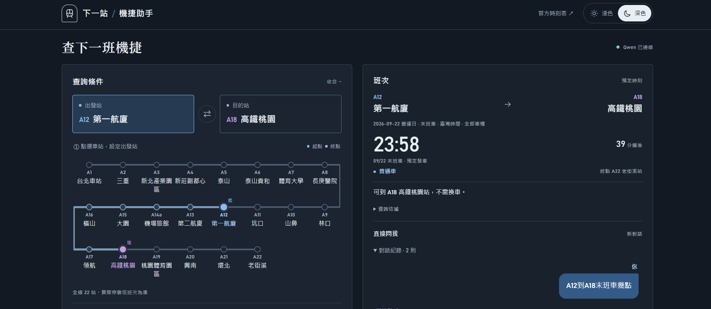
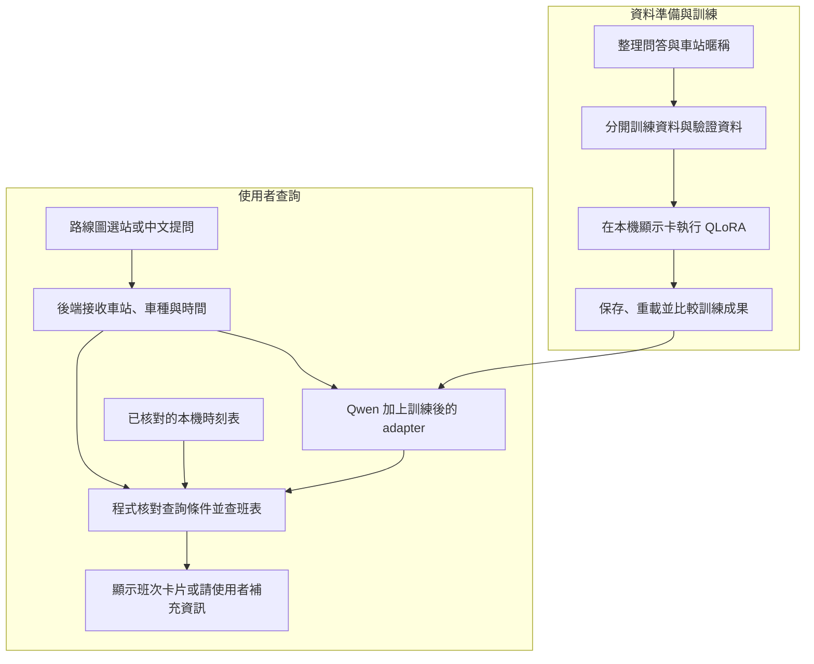

# 機場捷運AI智慧助手

**結合自行微調的 Qwen 模型與機捷班表，讓使用者透過中文提問或點選車站查詢班次。**

**[立即試用｜機場捷運AI智慧助手](https://huggingface.co/spaces/lee851104/tymetro-bot)**



## 1. 專案目標與功能

查班次看似簡單，實際上需要同時確認：從哪站出發、要去哪站、搭普通車還是直達車，以及平日或假日的時刻表。

旅客可能只說「北車到第二航廈，下一班普通車幾點？」如果 AI 認錯站名、搞混車種，或把列車終點當成旅客目的地，就可能給出錯誤的乘車建議。

本專案提供四項核心功能：

- **容易輸入：**提供全線 22 站的視覺選站，也接受中文問句與已審核的車站暱稱。
- **有資料依據：**班次來自已整理、核對的本機時刻表，查詢時不必重新瀏覽官網。
- **直接問首末班：**Qwen 聊天可問「A12 到 A18 末班車幾點」，依整個營運日及停靠規則查詢，包含跨午夜的列車。
- **說清楚限制：**資訊不完整時先追問；接近發車的班次另外提醒，避免鼓勵旅客趕車。

例如：以 **2026-09-22 10:00（臺灣時間）**查詢 A1 台北車站 → A13 第二航廈的普通車，資料回傳 **10:08、10:23**，並確認這兩班可以不換車到達目的站。

> 目前提供一般平假日的「預定發車時間」。班表資料範圍為 **2026-09-21～2026-10-04**，不含特殊活動、即時誤點、抵達時間、票價或轉乘規劃；超出資料範圍會明確告知。

## 2. 操作方式

上方為實際操作截圖：在 Qwen 模式輸入「A12 到 A18 末班車幾點」，介面顯示 2026-09-22 營運日的末班車為 **23:58 普通車**，並標示可到達 A18 高鐵桃園、不需換車。結果依本專案的一般班表產生。

實際介面採車站發車看板設計，提供**暖白淺色／午夜藍深色**切換並記住偏好，支援手機與桌面。藍色代表普通車、紫色代表直達車；選好起訖站、車種及日期時間後，以大字發車時間呈現結果，也保留中文聊天入口。

主畫面直接顯示完整路線圖，點選車站即可設定起訖；查詢後仍保留展開，可自行收合查詢條件。聊天時對話自動展開，以左右訊息泡泡與角色名稱區分旅客和機捷助手，也可自行收合。

操作方式：

1. 點選出發站或目的站欄位，再於路線圖選擇車站。
2. 設定車種及出發日期時間，送出查詢後查看班次看板。
3. 也可直接輸入中文問題，例如「A12 到 A18 末班車幾點」，並展開查詢依據確認結果來源。

截圖與上述完整流程使用 Qwen 模式；免 GPU 的班表展示模式啟動方式見[快速開始](#6-快速開始)。

## 3. 技術選擇

| 技術 | 在專案中做甚麼 | 為甚麼選它 |
| --- | --- | --- |
| **Qwen3-4B-Instruct-2507** | 作為中文問答與工具使用的基礎模型 | 採用 Unsloth 的 4-bit 量化版本，可在本機執行並比較訓練前後的行為 |
| **LoRA／QLoRA** | 在既有模型上訓練一小組額外權重；基礎模型以 4-bit 載入 | 降低訓練所需的顯示卡記憶體，讓 8 GB 顯示卡也能完成這次試訓 |
| **Unsloth、PyTorch、Transformers、TRL、PEFT** | 載入模型、執行訓練、保存與重載訓練結果 | 使用可重現的工具流程，保留設定、版本與評估紀錄 |
| **Python＋JSON／JSONL** | 整理時刻表、訓練對話、查班規則與後端服務 | 班次能直接查表與驗證，資料也容易人工審查及版本追蹤 |
| **HTML、CSS、JavaScript** | 製作視覺選站、查詢表單及班次卡片 | 不需要前端打包流程，方便本機啟動與展示 |
| **自動檢查與測試** | 檢查資料切分、工具參數、車種篩選及前後端查詢條件 | 把曾經答錯的情境留下來，避免改版後再次出錯 |

**LoRA 可以理解成替既有模型增加一份專案專用的「學習成果」。** 本次約訓練整體模型 **0.41%** 的參數；QLoRA 再降低基礎模型載入時的記憶體需求。這份額外權重稱為 adapter，必須搭配基礎模型使用。

## 4. 系統架構

專案有兩條流程：先整理資料、訓練模型，再把訓練結果放進查詢服務。



**模型負責學習如何對話與使用工具；涉及發車時間、車種與停靠的回答，由程式依資料核對後產生。** 選站表單的欄位會直接保留，避免模型重新猜測使用者選了哪一站。

平假日依行政院公布的辦公日曆判斷，班次依一般班表整理。完整時刻表放在查詢資料中，訓練案例使用工具查出的班次；更新班次資料時，不必讓模型重新背下整份時刻表。

## 5. 實作成果與驗證

### 完成可追查的本機 LoRA 訓練

從資料整理、訓練、保存權重，到在另一個程序重新載入，均有程式與紀錄可查。以下為 **2026-09-22 第二輪訓練實驗**的實測：

| 項目 | 結果 |
| --- | --- |
| 訓練設備 | NVIDIA RTX 4060，8 GB 顯示記憶體 |
| 訓練／驗證資料 | 70／17 筆對話，依情境群組隔離 |
| 訓練規模 | 1 輪、18 次更新；LoRA rank 8 |
| 驗證 loss | **2.7883 → 1.6856**；代表驗證資料上的預測誤差下降，不是答對率 |
| 訓練時間 | 約 **62 秒**，含該輪結束驗證；不含模型載入及後續回答評估 |
| 訓練成果 | 約 **33 MB** 的 adapter，已驗證可重新載入並接上展示介面 |

為了確認模型實際改善多少，另用相同的 8 個驗證情境比較：

| 檢查項目 | 原始模型 | 第二輪 LoRA |
| --- | ---: | ---: |
| 7 題需要查工具的情境中，正確呼叫工具 | 1／7 | **4／7** |
| 8 題中，完整回答檢查通過 | 0／8 | **2／8** |

**評估範圍：**這組比較使用 8 個固定驗證情境，由 AI 開發代理逐題檢查，屬開發階段評估，不代表使用者驗收或獨立盲測。另有 20 題獨立測試資料保留隔離，不納入本次結果。模型在工具使用與回答解讀上仍有錯誤，因此應用程式另以班表核對產生班次答案；介面查詢結果與原始模型評分分別記錄。[查看完整訓練與逐題報告](reports/training_round2.md)。

### 將真實錯誤改成可檢查的規則

曾出現「A1 到 A13 沒有普通車」的錯誤。修正後，程式會先找出符合車種與停靠條件的班次，再選最近兩班；也區分「旅客目的站」與「列車終點」。[查看修正與測試](reports/commuter_query_fix.md)。

### 確認使用者選的，就是實際查的

表單傳送明確站碼、車種與時間；後端回傳實際採用的條件，前端再次比對。若條件不一致，就不顯示該次班次卡片。[查看介面實測](reports/visual_station_picker.md)。

### 資料、評估與回答都有依據

- **隔離評估資料：**相同情境的改寫題不跨訓練與驗證集合，獨立測試題不參與訓練與調參。
- **記錄資料版本：**保存來源與檔案指紋（SHA-256），可追查訓練用了哪版資料及權重。
- **保留原始模型回答：**分開記錄模型輸出與程式核對結果，方便找出錯誤發生在哪一層。
- **處理容易忽略的邊界：**3 分鐘內發車的班次另外提醒；若只剩末班，不會編造不存在的下一班。3 分鐘是本專案的提醒政策，不是官方進站時間。

### 驗證實際操作流程

| 驗證情境 | 紀錄結果 |
| --- | --- |
| 一般班次查詢 | Qwen 模式下，以 2026-09-22 10:00 查詢 A1 → A13 普通車，顯示 10:08、10:23 |
| 末班車查詢 | 2026-09-22 營運日，A12 → A18 顯示 23:58 普通車；A12 → A13 則為隔日 00:28，依目的站停靠分別處理 |
| 桌面與手機版面 | 完整路線圖版本已檢視 1280px 桌面與 390px 手機版面，無橫向溢出 |
| 深淺主題與對話 | 切換主題保留查詢條件與結果；旅客、助手訊息分開呈現，對話可展開與收合 |

以上為特定情境的操作驗證，紀錄見[首末班查詢](reports/first_last_query.md)及[介面與主題驗證](reports/theme_redesign.md)。

## 6. 快速開始

### 先體驗介面與查班功能（不需要顯示卡）

準備 **Git 與 Python 3.11**，在 Windows PowerShell 執行：

```powershell
git clone https://github.com/lee851104/tymetro_bot.git
cd tymetro_bot
py -3.11 -m venv .venv
.\.venv\Scripts\python.exe -m scripts.serve_demo --engine timetable --port 8765
```

開啟 [本機展示頁](http://127.0.0.1:8765/)，選擇 A1 → A13，日期設為 **2026-09-22**、時間 **10:00**，即可查詢資料範圍內的班次。按 `Ctrl+C` 停止服務。

此模式只需 Python 標準函式庫，提供介面與班表查詢，**不載入 Qwen 或 LoRA**；車種篩選在下方 Qwen 模式開放。若已有服務占用 8765，可改用其他連接埠。

### 執行已訓練的 Qwen 模式

需要相容的 NVIDIA GPU 與已安裝的訓練環境，詳見 [Windows 環境說明](config/README.md)。本機還需備妥：

- 基礎模型快取：`models/huggingface/`
- 本專案訓練的 adapter：`outputs/airport_mrt_adapter/adapter/`

```powershell
.\.venv\Scripts\python.exe -m scripts.serve_demo --engine qwen --port 8765
```

等待頁面顯示模型就緒，即可使用 LoRA 模型與普通車／直達車篩選。推論使用本機模型，不呼叫外部模型 API；服務僅開放本機連線。

**模型交付方式：**Git 儲存庫提供程式、訓練資料、設定與評估報告；基礎模型及 adapter 不隨儲存庫分發。全新複製後，可先執行免 GPU 的班表展示；要重現 Qwen 模式，請依[開發與重現指南](docs/development.md)下載基礎模型、檢查資料並訓練產生 adapter，再啟動服務。Qwen 模式需有可載入的 adapter 才能就緒。

## 7. 技術文件與驗證紀錄

### 專案目錄

```text
tymetro_bot/
├── README.md                 # 專案介紹、操作畫面與快速開始
├── MODEL_CARD.md             # 模型用途、評估與限制
├── config/                   # 模型模板與環境版本
├── data/
│   ├── raw/qa/               # 五份 QA Markdown 原稿
│   ├── processed/            # 初版模擬資料，供歷史追查
│   ├── training/             # 現行訓練與驗證資料、來源雜湊
│   ├── eval/                 # 獨立測試題
│   ├── review/               # 人工審查與修訂紀錄
│   ├── timetable/            # 一般班表、停靠規則與日曆
│   └── knowledge/            # 官方資訊來源快照
├── src/                      # 查班規則、模型推論與服務模組
├── scripts/                  # 資料準備、訓練、評估與啟動入口
├── tests/                    # 自動化測試
├── web/                      # 網頁介面
├── deploy/                   # 部署設定與入口
├── docs/                     # 開發指南、初版訓練計畫與圖片
├── reports/                  # 訓練、資料核對與操作驗證報告
└── .github/workflows/        # CI 檢查
```

小型資料與來源紀錄納入版本管理，方便重現；`models/`、`outputs/`、虛擬環境及部署暫存由 `.gitignore` 排除。各指令均在專案根目錄執行。

### 文件索引

| 想了解的內容 | 文件 |
| --- | --- |
| 模型用途、評估範圍與不適用情境 | [模型說明](MODEL_CARD.md) |
| QA 原稿與初版設計 | [QA 原稿索引](data/raw/qa/README.md)・[初版訓練計畫](docs/training-plan.md) |
| 訓練設定、前後比較與錯誤分析 | [第二輪訓練報告](reports/training_round2.md)・[機器可讀指標](reports/training_round2_metrics.json) |
| 重建資料、訓練、驗證與程式入口 | [開發與重現指南](docs/development.md)・[環境與模型格式](config/README.md) |
| 時刻表來源、有效日期與平假日判定 | [班表資料說明](data/timetable/README.md)・[圖片核對紀錄](reports/timetable_image_review.md) |
| 車站暱稱與歧義處理規則 | [應用程式採用的站名設定](data/station_aliases.json) |
| 模型如何接入介面、如何核對班次 | [Qwen 接線紀錄](reports/qwen_demo_connection.md)・[普通車修正](reports/commuter_query_fix.md)・[視覺選站實測](reports/visual_station_picker.md) |
| 發車看板設計與深淺主題 | [新版外觀與操作驗證](reports/theme_redesign.md) |
| 為甚麼首末班能直接問、如何處理跨午夜 | [首末班查詢修正](reports/first_last_query.md) |
| 訓練流程參考與本專案的調整 | [T4 教材對照](reports/notebook_training_review.md)・[Astronomy LoRA 專案對照](reports/astronomy_lora_review.md) |

## 8. 使用範圍與授權

本專案供作品展示、技術審查與本機實驗，班次資訊限於所附一般班表的日期範圍。實際乘車請以桃園捷運官方公告與現場資訊為準。

**原創程式碼未授予開源授權。** 公開展示不等於授權自由重用或散布；如需取得額外使用授權，請洽著作權人。

基礎模型、第三方套件與官方資料各自適用其來源條款；引用來源保留在對應的資料說明與報告中。本專案為獨立實作，未代表或獲得桃園捷運官方背書。
